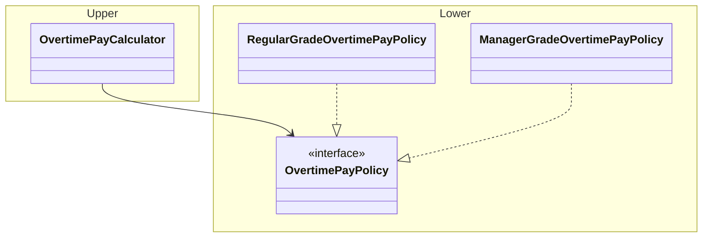
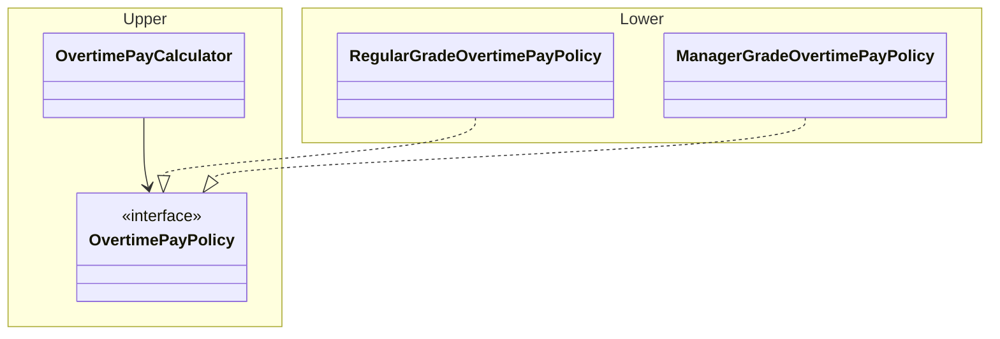

# 1. アーキテクトの仕事
## アーキテクトの定義
### 『ITスキル標準 V3 2011』（情報処理推進機構   / IPA）によるITアーキテクトの説明
- ビジネス及びIT上の課題を分析し、ソリューションを構成する情報システム化要件として再構成する。
- ハードウェア、ソフトウェア関連技術を活用し、顧客のビジネス戦略を実現するために情報システム全体の品質を保ったITアーキテクチャを設計する。
- 設計したアーキテクチャが課題に対するソリューションを構成することを確認するとともに、後続の開発、導入が可能であることを確認する。
- ソリューションを構成するために情報システムが満たすべき基準を明らかにする。さらに実現性に対する技術リスクについて事前に影響を評価する。

### システムアーキテクト試験（SA）における業務と役割の説明
- 情報システム戦略を具体化するための情報システムの構造の設計や開発に必要となる要件の定義、システム方式の設計及び情報システムを開発する業務に従事し、次の役割を主導的に果たすとともに、下位者を指導する。

### アーキテクトの主要な職務
- 企業のIT戦略を実現するための最適なアーキテクチャ設計ならびに実現

## アーキテクチャ設計の歴史
### 2000年代のアーキテクチャ設計のトレンド
- 業務システムではメインフレームからオープンシステムへの移行が進んだ
- ECサイトなどの一般消費者向けのWebサイトが重要な位置付けになった
- クライアントサーバシステム（C/Sシステム）からWebアプリケーションへの移行が進み、StrutsなどのWebアプリケーションフレームワークが生まれた
  - クライアントサーバシステム：クライアント端末にインストールされた業務アプリケーションから直接データベースへアクセスする
  - Webアプリケーション：「ブラウザ - APサーバ - DBサーバ」という三層構造を取る
- アプリケーション統合の観点では、SOAという設計思想が生まれ、EBSと呼ばれるミドルウェア製品も導入が進んだ
  - SOA：既存のアプリケーション機能をサービス単位で再利用することを狙った設計思想

### 2020年代のアーキテクチャ設計のトレンド
- AWSなどの登場により、クラウドファーストという考え方やクラウドネイティブという概念が重要視されている
  - クラウドファースト：新たなシステムを導入する際には、まずはクラウド基盤を最優先に検討するべきという考え方
  - クラウドネイティブ：クラウド環境へのデプロイやクラウドサービスの利用を前提として、クラウドに最適化したアーキテクチャを選定するべきとする概念
- REST APIの採用が広がり、アプリケーション間の連携がより容易に実現可能になった
  - REST：HTTPの仕組みを利用してアプリケーション間のデータ通信をシンプルに実現する設計原則
- マイクロサービスアーキテクチャが提唱され、採用事例が増えている
  - マイクロサービスアーキテクチャ：複数の独立した小さなサービスを組み合わせて一つのアプリケーションを構築するアーキテクチャ

## アーキテクトに必要な資質
### 設計力・コーディング力
- アーキテクチャ設計はクラス設計やコンポーネント設計と比べてより概念レベル、方針レベルの検討が必要となる
- アーキテクチャレベルでも通用するクラス設計やコンポーネント設計の設計原則が多くある
- 下位レベルの設計やコーディングをしっかりできないと良いアーキテクチャ設計は難しい
- 技術トレンドの移り変わりに合わせて、設計力とコーディング力は磨き続ける必要がある

### 抽象化能力
- 良い設計は抽象と具象がうまく分離されている
- 問題領域において、重要な本質的な部分と置き換え可能な詳細部分に分けて考えることでソフトウェアの柔軟性や拡張性が生まれる
- 抽象と具象の自由自在な行き来ができる能力は重宝する
  - 具体例を分析し、一般的に適用されるパターンや方針を導き出すときには抽象化する能力が大事
  - 顧客やステークホルダーと会話する際には具体例を用いた方が良い（抽象レベルの会話は空中戦になりがち）

### ビジネスの理解
- アーキテクチャは、IT戦略を実現し企業に利益をもたらすソフトウェアの礎となる
- ビジネスに対する理解が浅いアーキテクトが設計すると、優先事項を間違え役に立たないアーキテクチャができあがるリスクがある
- ビジネスの専門家と会話をし、いかにしてソフトウェアやそのアーキテクチャにとって重要な情報を引き出せるかがポイント

### 好奇心
- ソフトウェアを実現する技術は絶え間なく進化している
- 一つの決まったやり方に固執するのではなく、様々な選択肢を評価しその中から選択をすることが求められる
- 常日頃からアンテナを張って情報を収集し続ける姿勢が大切

### 完璧主義より合理主義
- 大規模ソフトウェアのどの断片も良い設計で良いコードであることは理想だが現実的ではない
- 全ての項目で満点を取れるアーキテクチャは存在しない
- 課題を優先づけてほどほどに良いアーキテクチャを目指すための合理的な判断を下すことが必要

# 2. ソフトウェア設計

## ソフトウェア開発のプロセス
### 要求分析
- 顧客の現行業務（As-Is）のヒアリングを行い、業務の流れや業務ルールを整理した後に、あるべき姿（To-Be）を描く。成果物としては業務フロー図などを作成する
- 要求分析の前半では、対象業務領域を分析し、業務上の課題をソフトウェアによって解決する観点でモデリングを行う
  - To-Beの新業務フローを実現するためにソフトウェアが利用者に提供する機能をユースケースモデル（ユースケース図とユースケース記述）として定義する
  - 対象業務領域における重要な概念（業務イベントや業務データ）をそれらの関係性を表す概念モデルをクラス図を用いて作成する
- 要求分析の後半では、各ユースケースを実現するために必要になる機能（画面や帳票、外部システムとのインタフェース）定める

### 設計
- 要求分析で定められた要求仕様をプログラミング言語やフレームワーク、ライブラリを使って実装する方法について具体的に計画する
- 大規模で複雑なものは一本のプログラムでは実装できないため、複数の構成要素に分割する必要がある
- 設計では以下の3つの事柄を検討し決定する
  - 構成要素への分割方法
  - 各構成要素への責務の割り当て
  - 構成要素同士の相互作用
- 設計した結果を設計モデルや詳細設計書のようなドキュメントとして残す方法や、CRCカードやテスト駆動開発などで設計ドキュメントを残さない方法など、プロジェクトの方針によってアプローチは異なる

### 実装・テスト
- 設計に基づいて実際に動作するソースコードを実装し、でき上がったソフトウェアにより要件が満たされることをテストで検証する
- プロジェクトで採用する開発プロセスに合わせて適切なテスト計画を立てることが重要

## ソフトウェア設計の抽象レベル
### クラス設計
- プログラミングの最小単位となる構成要素の設計
- ソースコードとしては、1クラスを1ファイルに記述することが多く、概ねファイル単位の粒度となる

### コンポーネント設計
- クラス設計よりも高い抽象度で、コンポーネントをどのように構成し、それらを協調せるかを決める設計
  - コンポーネント：特定の振る舞いを提供する責務を持ち、明確なインタフェースにより定義されたソフトウェアの構成部品のこと
- ソースコードとしては、コンポーネントを構成するクラス群をパッケージや名前空間として一箇所にまとめて管理することが一般的

### モジュール設計
- システムを構成するモジュール構成を決める設計
  - モジュール：コンポーネントの集合体。コンポーネント単体ではユーザにとって意味あるタスクを実行することはできない一方で、モジュールはユースケースの実行に必要な機能を提供する。
- ソースコードとしては、配下に多くのコンポーネントやクラスが存在するパッケージツリー構造全体に該当する

### アーキテクチャ設計
- システム全体の構造やアプリケーションの基本構造を決定する最も抽象度が高い設計
  - システム全体の構造：マイクロサービスアーキテクチャなど
  - アプリケーションの基本構造：レイヤードアーキテクチャなど
- 下位の設計に影響を与えるようなシステム全体の思想や方針を定めることもアーキテクチャ設計の一部

## ソフトウェアの設計原則（SOLID原則）
### SRP：単一責任の原則
> クラスを変更する理由は1つ以上存在してはならない。
- **クラスにはただ一つの明確な役割（責任）を持たせるべきという原則**
- 複数の役割を担うとクラスは肥大化しコードの見通しが悪くなったり、依存関係が複雑化したりする可能性がある
- 役割の粒度：クラスを利用するクライアント（別のクラス）の視点から判断すると良い。クライアントがそれ自身の処理を完遂するために依頼するタスクの利用目的がそのクラスの役割となる。

SRP適用前のコード
- WorkRecordクラスには二つの役割が混在してしまっている
  - 残業時間計算：給与計算と労働環境チェックなどの複数のユースケースで必要
  - 残業代計算：給与計算のユースケースでのみ必要
- もし給与計算の仕様に変更が入り、残業代計算に必要な情報がコンストラクタ引数に追加されると、本来無関係な労働環境チェック処理のプログラムにも修正が波及してしまう

```java
// WorkRecord.java
// 勤怠実績　
public record WorkRecord(LocalDate date, boolean isHoliday,
                         LocalDateTime clockIn, LocalDateTime clockOut, Grade grade) {
    private static final int STANDARD_WORK_HOURS = 8; // 標準労働時間　
    private static final int BREAK_TIME = 1; // 休憩時間

    // 残業時間計算
    public int calcOvertimeHours() {
        // 休憩時間を考慮して勤務時間を計算
        int hours =
                (int)Duration.between(clockIn, clockOut).minusHours(BREAK_TIME).toHours();
        // 休日は全て残業扱い
        if (isHoliday()) {
            return hours;
        }
        // 標準労働時間よりも短い場合は残業なしとする
        if (hours <= STANDARD_WORK_HOURS) {
            return 0;
        }
        // 残業時間を計算（1時間未満は切り捨て）
        long overtime = Math.max(hours - STANDARD_WORK_HOURS, 0);
        return (int) overtime;
    }

    // 残業代計算
    public int calcOvertimePay() {
        return calcOvertimeHours() * grade().hourlyRate();
    }
}
```

SRP適用後のコード
- 残業代計算を別のクラスに分離

```java
// WorkRecord.java
// 勤怠実績　
public record WorkRecord(LocalDate date, boolean isHoliday,
                         LocalDateTime clockIn, LocalDateTime clockOut) {
    private static final int STANDARD_WORK_HOURS = 8; // 標準労働時間　
    private static final int BREAK_TIME = 1; // 休憩時間

    // 残業時間計算
    public int calcOvertimeHours() {
        // 休憩時間を考慮して勤務時間を計算
        int hours =
                (int)Duration.between(clockIn, clockOut).minusHours(BREAK_TIME).toHours();
        // 休日は全て残業扱い
        if (isHoliday()) {
            return hours;
        }
        // 標準労働時間よりも短い場合は残業なしとする
        if (hours <= STANDARD_WORK_HOURS) {
            return 0;
        }
        // 残業時間を計算（1時間未満は切り捨て）
        long overtime = Math.max(hours - STANDARD_WORK_HOURS, 0);
        return (int) overtime;
    }
}

// OvertimePayCalculator.java
// 残業代計算クラス
public class OvertimePayCalculator {
    // 残業代計算
    public int calcOvertimePay(int overtimeHours, Grade grade) {
        return overtimeHours * grade.hourlyRate();
    }
}
```

### OCP：オープン・クローズドの原則
> ソフトウェアの構成要素（クラス、モジュール、関数など）は拡張に対して開いていて、修正に対して閉じていなければならない。
- **既存のコードを修正することなく新たな振る舞いを追加して拡張することが可能な設計**を意味する
- OCPの核心は変更が少ない安定的なコードと変更が多い不安定なコードを分離すること
  - 安定的なコードは不安定で具体的な実装に直接依存するのではなく、抽象に対して依存するようにする
  - 修正が局所化されることで、テストすべき範囲も局所化される

OCP適用前のコード
- calcOvertimePayメソッドでは、switchを使って一般職と管理職の休日残業代計算ロジックが記述されている
- 管理職でも休日残業代を支払うように仕様変更が発生した場合に、この条件分岐ロジックを修正する必要がある

```java
// OvertimePayCalculator.java
// 残業代計算クラス
public class OvertimePayCalculator {
    // 残業代計算
    public int calcOvertimePay(WorkRecord workRecord, Grade grade) {
        return switch (grade) {
            case Regular ->
                    (int) (workRecord.calcOvertimeHours() * grade.hourlyRate()
                            * (workRecord.isHoliday() ? 1.2 : 1)); // 休日は2割増し
            case Manager -> 0; // 管理職は残業代なし
        };
    }
}
```

OCP適用後のコード
- OvertimePayCalculatorでは、OvertimePayPolicyインタフェースを利用して計算を行うように変更
- インタフェースの具体的な実装オブジェクトを生成するファクトリーであるOvertimePayPolicyFactoryを作成
- 残業代支払率の具体的なルールは、RegularGradeOvertimePayPolicyとManagerGradeOvertimePayPolicyに実装

```java
// OvertimePayCalculator.java
// 残業代計算クラス
public class OvertimePayCalculator {
    // 残業代計算
    public int calcOvertimePay(WorkRecord workRecord, Grade grade) {
        var policy = OvertimePayPolicyFactory.of(workRecord.isHoliday(), grade);
        return (int) (workRecord.calcOvertimeHours() * grade.hourlyRate() * policy.paymentRate());
    }
}

// OvertimePayPolicy.java
// 残業代支払ポリシー
public interface OvertimePayPolicy {

    double paymentRate();
}

// OvertimePayPolicyFactory.java
// 残業代ポリシーのファクトリー
public class OvertimePayPolicyFactory {

    public static OvertimePayPolicy of(boolean isHoliday, Grade grade) {
        return switch (grade) {
            case Regular -> new RegularGradeOvertimePayPolicy(isHoliday);
            case Manager -> new ManagerGradeOvertimePayPolicy(isHoliday);
        };
    }
}

// RegularGradeOvertimePayPolicy.java
public class RegularGradeOvertimePayPolicy implements OvertimePayPolicy {

    private boolean isHoliday;

    public RegularGradeOvertimePayPolicy(boolean isHoliday) {
        this.isHoliday = isHoliday;
    }

    @Override
    public double paymentRate() {
        return isHoliday ? 1.2 : 1; // 休日は2割増し
    }
}

// ManagerGradeOvertimePayPolicy.java
public class ManagerGradeOvertimePayPolicy implements OvertimePayPolicy {

    private boolean isHoliday;

    public ManagerGradeOvertimePayPolicy(boolean isHoliday) {
        this.isHoliday = isHoliday;
    }

    @Override
    public double paymentRate() {
        return isHoliday ? 1 : 0; // 休日残業は支払われる
    }
}
```

### LSP：リスコフの置換原則
> 派生型はその基本型と置換可能でなければならない
- **ある基本型を使って処理を記述したどのようなプログラムに対しても、その振る舞いを変えることなく基本型を派生型で置き換え可能でなければならないという原則**
- アプリケーションにおける振る舞いの条件（事前条件・事後条件・不変条件）を明確にする必要がある
  - 基本型の定める事前条件を派生形が強めてはいけない
  - 基本型の定める事後条件を派生形が弱めてはいけない
  - 不変条件は維持しなければいけない

LSP適用前のコード
- Ticketにはポイント数で見積もりを行うestimateメソッドがあり、事前条件としてポイント数が正の整数であることを宣言している
- TicketのサブクラスであるStoryTicketは、estimateメソッドをオーバーライドして独自の事前条件を追加し、ポイント数がフィボナッチ数であることをチェックしている
- estimateAllTicketsのようなメソッドが存在したときに、TicketクラスのクライアントがTicketの定める事前条件を守っていたとしてもフィボナッチ数でない数がStoryTicketに渡された場合はエラーが発生してしまう

```java
// Ticket.java
public abstract class Ticket {

    protected int point;

    public void estimate(int point) {
        assert point >= 1 : "見積もりは正の整数(ポイント)であること";
        this.point = point;
    }
    // そのほかのメソッドは省略
}

// StoryTicket.java
public class StoryTicket extends Ticket {

    private static final Set<Integer> FIBONACCI_NUMBERS = Set.of(1, 2, 3, 5, 8, 13, 21);

    @Override
    public void estimate(int point) {
        assert FIBONACCI_NUMBERS.contains(point) : "見積もりポイントはフィボナッチ数を使用すること";
        super.estimate(point);
    }
}

// LspViolationSample.java
public class LspViolationSample {

    // 一括で見積もりを行うメソッド
    public void estimateAllTickets(List<Ticket> tickets, int estimationPoint) {
        // estimationPoint = 4 でかつチケットが StoryTicket の場合、AssertError が発生!
        tickets.forEach(it -> it.estimate(estimationPoint));
    }
}
```

### ISP：インタフェース分離の原則
> クライアントに、クライアントが利用しないメソッドへの依存を強制してはならない
- **大きなインタフェースをクライアントごとに小さなインタフェースに分離すること**を意味する
- インファフェースを分離することで、変更が局所化され依存しないメソッドの変更の影響を受けなくなる
- SRP（単一責任の原則）との関連が強い

ISP適用前のコード
- Ticketはインタフェースとして定義され、5つの抽象メソッドを持つ
- IssueTicketは見積もりと実績記録を行わないため、estimateとrecodeメソッドはExceptionをthrowするように実装されている
  - Ticketインタフェースを利用するクライアントコードがIssueTicketのことを意識せずに呼び出すと、予期せぬタイミングでExceptionが発生する可能性がある（LSPの違反でもある）

```java
// Ticket.java
public interface Ticket {
    // チケットの開始
    void start();
    // チケットの終了
    void close();
    // 担当割り当て
    void assign(String assignee);
    // 見積もり
    void estimate(int estimationPoint);
    // 実績記録
    void record(int actualPoint);
}

// BugTicket.java
public class BugTicket implements Ticket {
    //省略
}

// StoryTicket.java
public class StoryTicket implements Ticket {
    // 省略
}

// IssueTicket.java
public class IssueTicket implements Ticket {
    @Override
    public void start() {
    }

    @Override
    public void close() {
    }

    @Override
    public void assign(String assignee) {
    }

    @Override
    public void estimate(int estimationPoint) {
        throw new UnsupportedOperationException();
    }

    @Override
    public void record(int actualPoint) {
        throw new UnsupportedOperationException();
    }
}
```

ISP適用後のコード
- estimateメソッドとrecordメソッドを Estimatable インタフェースとして切り出す
- BugTicketとStoryTicketはTicketとEstimatableの2つのインタフェースを実装し、IssueTicketはTicketインタフェースのみを実装するようになった
- 見積もりと実績記録に関する仕様変更が発生してEstimatableが変更されても、IssueTicketは変更の影響を受けなくなった

```java
// Ticket.java
public interface Ticket {
    // チケットの開始
    void start();
    // チケットの終了
    void close();
    // 担当割り当て
    void assign(String assignee);
}

// Estimatable.java
public interface Estimatable {
    // 見積もり
    void estimate(int estimationPoint);

    // 実績記録
    void record(int actualPoint);
}

// BugTicket.java
public class BugTicket implements Ticket, Estimatable {
    //省略
}

// StoryTicket.java
public class StoryTicket implements Ticket, Estimatable {
    // 省略
}

// IssueTicket.java
public class IssueTicket implements Ticket {
    // 省略
}
```

### DIP：依存関係逆転の原則
> a. 上位のモジュールは下位のモジュールに依存してはならない。どちらのモジュールも「抽象」に依存するべきでさる。
> b. 「抽象」は実装の詳細に依存してはならない。実装の詳細が「抽象」に依存するべきである。
- コンポーネントやモジュール分割をする際の依存関係について定めたものであり、SOLIDの他の四原則よりも抽象レベルを上げて考える必要がある
- 上位の方針に比べて下位の実装の詳細は不安定なので、上位から下位へ依存することにより、下位の変更の影響を受けてしまうことを避けたい
- コンポーネント間の依存関係の方向が下位から上位になることで、上位のコンポーネントは下位のコンポーネントの存在を一切意識することなく独立して開発やテストを進めることができるようになる

DIP適用前の依存関係
- このような分割だと上位から下位への依存が発生してしまう
  - OvertimePayPolicyを利用してOvertimePayCalculatorが残業代計算をする方針にあたる
  - RegularGradeOvertimePayPolicyやManagerGradeOvertimePayPolicyが提供する具体的な計算ルールは実装の詳細に当たる



DIP適用後の依存関係
- OvertimePayPolicyを上位のコンポーネント側に配置し他ことでコンポーネント間の依存関係の方向は下位から上位に逆転した



## CLEANコード
- 5つのコード品質を満たすようなコードを目指し、ソフトウェアの内部品質を高めようとする考え方
  - **凝集性（Cohesive）**
    - コンポーネントやモジュールに含まれる構成要素の関連度合いやまとまり具合
    - 凝集性が高いコードは密接に関連し合った構成要素の集まりが単一の責任を果たす
  - **疎結合（Loosely Coupled）**
    - 間接的な依存関係
    - オブジェクト指向設計では抽象クラスやインタフェースを使って実現する
  - **カプセル化（Encapsulated）**
    - クライアントが関心を持たない詳細を隠すこと
    - クライアントが求めること（What）とその実現方法（How）を切り離すことでコード間の結合度を下げることができる
    - 基本的に内部のデータは隠蔽して必要とされるものだけを振る舞いとして外部に公開するようにするべき
  - **断定的（Assertive）**
    - 必要なデータと振る舞いを一箇所に持っていてオブジェクトが他のオブジェクトにむやみに依存することなく責務を果たせること
  - **非冗長（Nonredundant）**
    - 同じコードがあちこちに重複して存在していないこと

## 中核ロジックと処理フローロジック
- ソフトウェアの振る舞いを実現するコードは中核ロジックと処理フローロジックの二種類に分けることができる
- 一般的に中核ロジックと処理フローロジックは役割を明確に分けて設計した方がコードの見通しは良くなる

### 中核ロジック
- 業務の知識やルールを表すもの
- ビジネスロジックの中でもドメインロジックと呼ばれる
- 例：注文を登録するユースケースにおいて、「値引きや発送料込みの注文金額の計算を行う」処理は注文オブジェクトの振る舞いとして実装される

### 処理フローロジック
- 業務処理の手順を表すもの
- ビジネスロジックの中でもアプリケーションロジックと呼ばれる
- 例：「注文金額を計算し、決済手段の有効性が確認できたら、在庫を引き当てたあと、注文を登録する」という一連の流れは注文登録サービスの振る舞いとして実装される

## デザインパターン
- デザインパターンで有名なGoFのデザインパターンでは、「生成に関するパターン」「構造に関するパターン」「振る舞いに関するパターン」の3つに分類されていて合わせて23のパターンが存在する

> ソフトウェアにおける**パターン**とは、よく遭遇する設計上の問題に対する解決策や設計アプローチを再利用可能な形式にまとめたもの

- 生成に関するパターン
  - Abstract Factoryパターン
  - Builderパターン
  - Factory Methodパターン
  - Prototypeパターン
  - Singletonパターン

- 構造に関するパターン
  - Adapterパターン
  - Bridgeパターン
  - Compositeパターン
  - Decoratorパターン
  - Facadeパターン
  - Flyweightパターン
  - Proxyパターン

- 振る舞いに関するパターン
  - Chain of Responsibilityパターン
  - Commandパターン
  - Interpreterパターン
  - Iteratorパターン
  - Mediatorパターン
  - Mementoパターン
  - Observerパターン
  - Stateパターン
  - Strategyパターン
  - Template Methodパターン
  - Visitorパターン

## アーキテクチャスタイルとアーキテクチャパターン
### アーキテクチャスタイル
- **ソフトウェアのソースコードの編成の仕方や相互作用についての「包括的な構造」**
- 全体的な方針を定めるコンセプトであり、アーキテクチャパターンの上位に位置づけられる抽象度の高いもの
- 代表的なアーキテクチャスタイル
  - モノリシック
    - レイヤードアーキテクチャ
    - パイプラインアーキテクチャ
    - マイクロカーネルアーキテクチャ
  - 分散
    - サービスベースアーキテクチャ
    - イベント駆動アーキテクチャ
- 上記のアーキテクチャスタイルの粒度は必ずしも揃っていないだけでなく、概念が直交するものもあるため、一つを選ぶというより一つ以上のアーキテクチャスタイルのコンセプトをアーキテクチャの方針として採用する場合が多い

### アーキテクチャパターン
- **特定の解決策を形成するのに役立つ低レベルの設計構造**
- アーキテクチャの方針を具体的なコードに落とし込んでいく際に適用するパターン
- 例：ドメイン層（ビジネスロジック層）のアーキテクチャパターン
  - トランザクションスクリプト
  - ドメインモデル
  - テーブルモジュール
  - サービスレイヤー
- それぞれのパターンにはメリットとデメリットがあるため、特徴を把握した上で解決したい問題に応じて適切にパターンを使い分ける

# 3. アーキテクチャの設計
## アーキテクチャの定義
ISO/IEC/IEEE 42010:2011における定義（日本語訳）
> **環境におけるシステムの基本的な概念や特性が、その要素や関係、および設計と進化の原則に具体かされたもの**
  - システムには何らかの課題を解決しユーザに価値を提供するという目的があり、そのために備えるべき特性がある。それらの特性を具現化するものがアーキテクチャであり、複数の構成要素とそれらの関係によって成り立つ。
  - ソフトウェアをどのように設計し今後どう進化させていくときの根拠となる原理原則もひっくるめてアーキテクチャと述べられている

### アーキテクチャの4つの側面
- ①アーキテクチャによって達成するべきこと
  - システムは誰のために何の目的で作られるのかを明確にする必要がある
  - 目的がブレると期待通りに機能しないシステムを作ってしまう危険がある
  - アーキテクチャが達成するべきゴールを明らかにする
    - ビジネス要求やそれに基づいて要件化された機能のうちアーキテクチャに影響を与えるものを特定する
    - 非機能要求から重要な品質特性を特定する

---

# コラム
## ドメイン駆動設計とドメイン分析
### ドメイン駆動設計（DDD）
- 開発者とドメイン専門家との対話を通して得られた知識に基づくドメインモデルを構築し、そのドメインモデルを中心に捉えたソフトウェア開発を行うという設計思想・設計方法論
- ソフトウェア開発において、対象のドメイン（事業活動や業務領域）が本来的に持つ複雑さに対応するの方法
- 戦略的設計と戦術的設計に分けられる

### 戦略的設計
- システムをどう分割しどう統合するかという大局的な指針を示す
- 事業全体をコアドメインとサブドメインに区別してとらえる
  - コアドメイン：企業を成功に導くような重要で核心となる領域。ITリソースを集中投資知る価値がある領域。
  - サブドメイン；コアドメイン以外の領域。
- 「境界づけられたコンテキスト」の単位でサブドメイン分割を行う
  - 「境界づけられたコンテキスト」：ドメインモデルが関係者間で共通の語彙（ユビキタス言語）として通用する範囲

### 戦術的設計
- ビジネスの複雑性をコードにどのように反映させるか、具体的なアプローチやパターンに焦点を当てたもの

## 要求の3つのレベル
- 要求工学において、要求には3つのレベルがある
  - 業務要求：システムの顧客にとっての高レベルの目的
  - ユーザー要求：実際にシステムを利用するユーザが達成すべき目標
  - 機能要求：ユーザ要求を満たすために開発者がシステムに作り込む機能
- これらの要求はシステムに期待される振る舞いとしてソフトウェア要求仕様書に文書化される

## CRCカード
- 小さなカードを使ってクラスの責務と、責務を果たすために相互作用する相手を発見するモデリング手法
  - 適当なサイズのカードとペンを用意する
  - カードは上・左下・右下の3つの区画に分ける
    - 上の区画（クラス）：クラス名を書く
    - 左下の区画（責務）：クラスが果たすべき責務を並べる
    - 右下の区画（コラボレータ）：クラスが相互作用する（情報の取得や処理の依頼を行う）他のクラスを列挙する
- 複数人で机を囲んでカードを広げながら、各自の担当するクラスを決めてロールプレイングを行なって設計を進める
- 会話を通して新たなクラスの発見や適切な責務の再配置など、モデルを洗練していくことができる